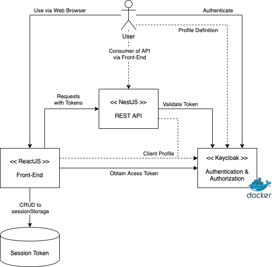

# What is this all about?

**Important Notice**: This project is still very much broken. I will update the notes and add more detailed documentation once all is done and working

Well, I like to document everything I learn. This repo, as you therefore may have guessed, is where I show how I implemented [React](https://reactjs.org/), [Nest](https://nestjs.com/) and [Keycloak](https://www.keycloak.org/) in order to demonstrate how the React app would consume a REST API, all following an OAUTH2 [Authorization Code Grant](https://tools.ietf.org/html/rfc6749#section-4.1) with [PKCE flow](https://tools.ietf.org/html/rfc7636).

# PoC Design



# Getting Started

## Pre-requisites

The solution relies on the following being available on the target system:

* Docker (used for Keycloak)
* NodeJS and `npm`

The PoC does not concern itself with deployment of the JavaScript application and both the ReactJS and NestJS applications will run in development ode as demonstrated.

The commands below assume a `Unix` like operating system (Linux, Mac OSX, *BSD etc.). If you are on Windows, [consider using WSL](https://docs.microsoft.com/en-us/windows/wsl/install-win10) for easier testing.

## Keycloak

The solution is based on the [Keycloak Docker Hub](https://hub.docker.com/r/jboss/keycloak/) latest image as on 2020-07-22.

To prepare the local service, run the following commands:

```bash
$ mkdir -p ~/tmp/keycloak-poc
$ cd keycloak
$ docker run -d -p 8180:8080 -e KEYCLOAK_USER=admin -e KEYCLOAK_PASSWORD=admin -v $HOME/tmp/keycloak-poc:/tmp --name keycloak-poc jboss/keycloak
```

After the keycloak instance is running, run the following command:

```bash
$ docker logs -f keycloak-poc
```

Wait until you see the following lines:

```text
   .
   .
   .
11:21:55,916 INFO  [org.jboss.as] (Controller Boot Thread) WFLYSRV0060: Http management interface listening on http://127.0.0.1:9990/management
11:21:55,916 INFO  [org.jboss.as] (Controller Boot Thread) WFLYSRV0051: Admin console listening on http://127.0.0.1:9990
11:21:55,916 INFO  [org.jboss.as] (Controller Boot Thread) WFLYSRV0025: Keycloak 10.0.2 (WildFly Core 11.1.1.Final) started in 18843ms - Started 689 of 994 services (708 services are lazy, passive or on-demand)
```

The server is now started and you can access the management console here: http://localhost:8180/

You can now create the client by importing the `keycloak/poc-front-end.json` file.

At this stage you can also create a user. The PoC assumes a username of `user1` with a password of `password`.

## NestJS - The REST API

```bash
$ cd nest/poc-rest-api
$ npm install
$ npm run start
```

## React - The Front-End

```bash
$ cd react/poc-front-end
$ npm install
$ npm start
```

# Acknowledgements

The following credits for photos from [Unsplash](https://unsplash.com/):

* <span>Photo by <a href="https://unsplash.com/@shotlist?utm_source=unsplash&amp;utm_medium=referral&amp;utm_content=creditCopyText">Shotlist</a> on <a href="https://unsplash.com/s/photos/table-mountain?utm_source=unsplash&amp;utm_medium=referral&amp;utm_content=creditCopyText">Unsplash</a></span>

# References

* [RFC 7516 - JSON Web Encryption (JWE)](https://tools.ietf.org/html/rfc7516)
* [RFC 7517 - JSON Web Key (JWK)](https://tools.ietf.org/html/rfc7517)