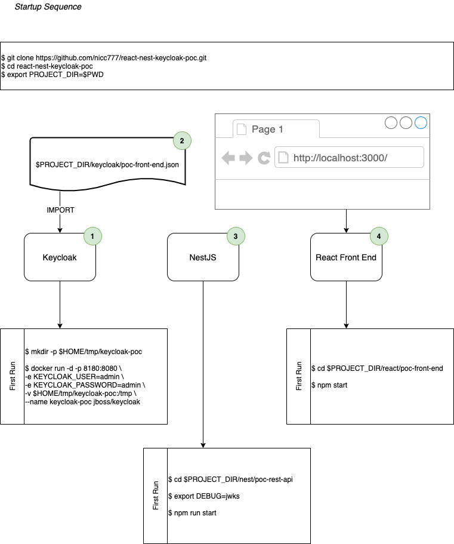
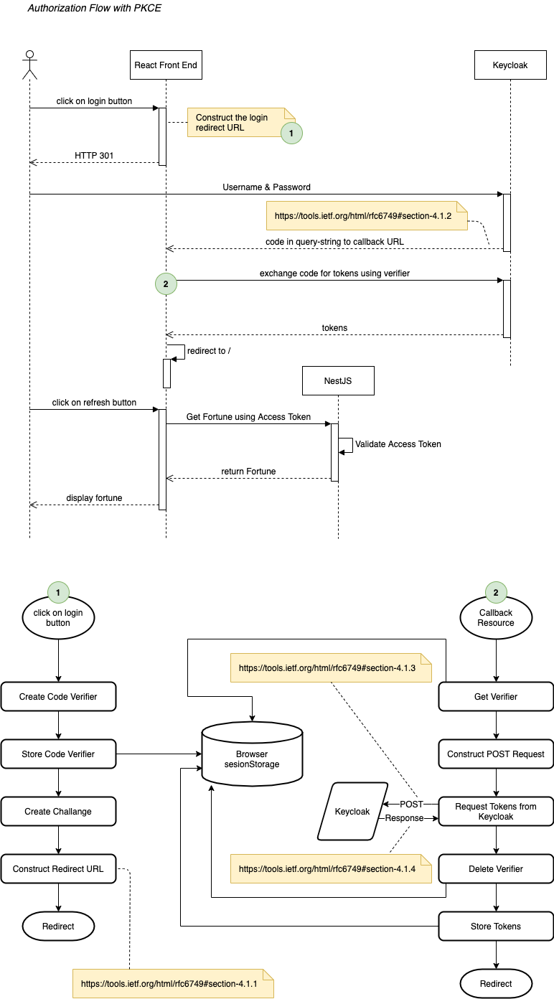

# What is this all about?

Well, I like to document everything I learn. This repo, as you therefore may have guessed, is where I show how I implemented [React](https://reactjs.org/), [Nest](https://nestjs.com/) and [Keycloak](https://www.keycloak.org/) in order to demonstrate how the React app would consume a REST API, all following an OAUTH2 [Authorization Code Grant](https://tools.ietf.org/html/rfc6749#section-4.1) with [PKCE flow](https://tools.ietf.org/html/rfc7636).

**Notice**: I still need to update the detailed instruction, but all is now working.

# PoC Design


# Getting Started

## Pre-requisites

The solution relies on the following being available on the target system:

* Docker (used for Keycloak)
* NodeJS and `npm`

The PoC does not concern itself with deployment of the JavaScript application and both the ReactJS and NestJS applications will run in development ode as demonstrated.

The commands below assume a `Unix` like operating system (Linux, Mac OSX, *BSD etc.). If you are on Windows, [consider using WSL](https://docs.microsoft.com/en-us/windows/wsl/install-win10) for easier testing.

Below is a diagram showing how to start-up all the required services. There is more details in the sub-sections.



## Keycloak

The solution is based on the [Keycloak Docker Hub](https://hub.docker.com/r/jboss/keycloak/) latest image as on 2020-07-22.

To prepare the local service, run the following commands:

```bash
$ mkdir -p ~/tmp/keycloak-poc
$ docker run -d -p 8180:8080 -e KEYCLOAK_USER=admin -e KEYCLOAK_PASSWORD=admin -v $HOME/tmp/keycloak-poc:/tmp --name keycloak-poc jboss/keycloak
```

After the keycloak instance is running, run the following command:

```bash
$ docker logs -f keycloak-poc
```

Wait until you see the following lines:

```text
   .
   .
   .
11:21:55,916 INFO  [org.jboss.as] (Controller Boot Thread) WFLYSRV0060: Http management interface listening on http://127.0.0.1:9990/management
11:21:55,916 INFO  [org.jboss.as] (Controller Boot Thread) WFLYSRV0051: Admin console listening on http://127.0.0.1:9990
11:21:55,916 INFO  [org.jboss.as] (Controller Boot Thread) WFLYSRV0025: Keycloak 10.0.2 (WildFly Core 11.1.1.Final) started in 18843ms - Started 689 of 994 services (708 services are lazy, passive or on-demand)
```

The server is now started and you can access the management console here: http://localhost:8180/

You can now create the client by importing the `keycloak/poc-front-end.json` file.

At this stage you can also create a user. The PoC assumes a username of `user1` with a password of `password`.

## NestJS - The REST API

Enable debug for `jwks-rsa`:

```bash
$ DEBUG=jwks
```

Then:

```bash
$ cd nest/poc-rest-api
$ npm install
$ npm run start
```

## Python Alternative API

You will require Python 3x for this.

Install the following dependencies:

```bash
$ pip3 install python_jwt python-keycloak flask flask-restful cryptography
```

Start the API service in debug mode with:

```bash
$ cd python/
$ python3 ./basic-service.py
```

The certificate and public key will be echoed to STDOUT on startup. The React front end, after login, will produce the following output when requesting a `fortune`:

```text
127.0.0.1 - - [27/Jul/2020 15:06:32] "GET /fortune HTTP/1.1" 200 -
bearer_token: eyJhbGciOiJSUzI1NiIsInR5cCIgOiAiSldUIiwia2lkIiA6ICJLMU5QYTluZDU4Tm5mMVExZHpHbktxUUtwNERMX1N6OTRUb3gxaENZbThBIn0.eyJleHAiOjE1OTU4Nzg3ODUsImlhdCI6MTU5NTg0MzAwNCwiYXV0aF90aW1lIjoxNTk1ODQyNzg1LCJqdGkiOiIxZTMyMWNmMC0yMzNkLTQ5YmQtYWJiZS03ODRmZjc2ZDE3N2IiLCJpc3MiOiJodHRwOi8vbG9jYWxob3N0OjgxODAvYXV0aC9yZWFsbXMvbWFzdGVyIiwiYXVkIjoiYWNjb3VudCIsInN1YiI6ImYzNDE3NWNiLWQ1ODgtNDJlOS1hMDhiLTA0MzY0ZTU4NzQ3ZiIsInR5cCI6IkJlYXJlciIsImF6cCI6InBvYy1mcm9udC1lbmQiLCJzZXNzaW9uX3N0YXRlIjoiZGNkZmNiNDQtZDgwNS00NjExLWE5OTYtMmFlYTI4MjdkMGIzIiwiYWNyIjoiMCIsImFsbG93ZWQtb3JpZ2lucyI6WyJodHRwOi8vbG9jYWxob3N0OjMwMDAiXSwicmVhbG1fYWNjZXNzIjp7InJvbGVzIjpbIm9mZmxpbmVfYWNjZXNzIiwidW1hX2F1dGhvcml6YXRpb24iXX0sInJlc291cmNlX2FjY2VzcyI6eyJhY2NvdW50Ijp7InJvbGVzIjpbIm1hbmFnZS1hY2NvdW50IiwibWFuYWdlLWFjY291bnQtbGlua3MiLCJ2aWV3LXByb2ZpbGUiXX19LCJzY29wZSI6Im9wZW5pZCBlbWFpbCBwcm9maWxlIiwiZW1haWxfdmVyaWZpZWQiOnRydWUsIm5hbWUiOiJVc2VyMSBTdXJuYW1lMSIsInByZWZlcnJlZF91c2VybmFtZSI6InVzZXIxIiwiZ2l2ZW5fbmFtZSI6IlVzZXIxIiwiZmFtaWx5X25hbWUiOiJTdXJuYW1lMSIsImVtYWlsIjoidXNlckBleGFwbGUudGxkIn0.LBKrvq_wXLeroYPNW4s2oytnLA12Ps6DmFIhMnBsDau_fKg4kenFaD3fC-cjWIITN0cK0LTbgGo7XQA1YH3r9PD_H4Y6xNWYALk1UVzUEK7PK_A6hy6DwGVamXFsBVt00vB7FfSnMJzPy50GMCORnpRgUnMwrDaOlCm5UHzr_5oN74K_BzsyrSb-yPR3mgs_dZkIMsxYiyxrm21jB5gBHQ-C_1Q7QIx9R4WAPKKhSVTACJwtvAW0ixub5vIqSdr-JpKwpktJFqAX8gvzvWkXFcoGrlgI4o2KVKw2jAU2VFuVX8OMAnf8JJPz6R2Nv-6C2dj149TPBmu_VxjNKWMXcA
token_info={'exp': 1595878785, 'iat': 1595843004, 'auth_time': 1595842785, 'jti': '1e321cf0-233d-49bd-abbe-784ff76d177b', 'iss': 'http://localhost:8180/auth/realms/master', 'aud': 'account', 'sub': 'f34175cb-d588-42e9-a08b-04364e58747f', 'typ': 'Bearer', 'azp': 'poc-front-end', 'session_state': 'dcdfcb44-d805-4611-a996-2aea2827d0b3', 'acr': '0', 'allowed-origins': ['http://localhost:3000'], 'realm_access': {'roles': ['offline_access', 'uma_authorization']}, 'resource_access': {'account': {'roles': ['manage-account', 'manage-account-links', 'view-profile']}}, 'scope': 'openid email profile', 'email_verified': True, 'name': 'User1 Surname1', 'preferred_username': 'user1', 'given_name': 'User1', 'family_name': 'Surname1', 'email': 'user@exaple.tld'}
127.0.0.1 - - [27/Jul/2020 15:06:51] "GET /fortune HTTP/1.1" 200 -
```

## React - The Front-End

```bash
$ cd react/poc-front-end
$ npm install
$ npm start
```

# Authentication Sequence (React Front End) - Authorization Flow with PKCE

The authentication sequence is demonstrated in the diagram below, which includes a bit more detail on the logical flows inside the React application.



# Request Authorization Design (NestJS)

The implementation follows the [passport-jwt](http://www.passportjs.org/packages/passport-jwt/) pattern to validate Access Tokens against known public certificates issued by the IDP (Keycloak), as illustrated by the diagram below:


**NOTE**: The `audience` and `issuer` is currently commented out as they will not validate the JWT correctly if supplied.

# References

* [NestJS - Implementing Passport JWT](https://docs.nestjs.com/techniques/authentication#implementing-passport-jwt)
* [Auth0 - Use Passport with NestJS](https://auth0.com/blog/developing-a-secure-api-with-nestjs-adding-authorization/#Use-Passport-with-NestJS)
* [RFC 6749 - The OAuth 2.0 Authorization Framework](https://tools.ietf.org/html/rfc6749)
* [RFC 7516 - JSON Web Encryption (JWE)](https://tools.ietf.org/html/rfc7516)
* [RFC 7517 - JSON Web Key (JWK)](https://tools.ietf.org/html/rfc7517)
